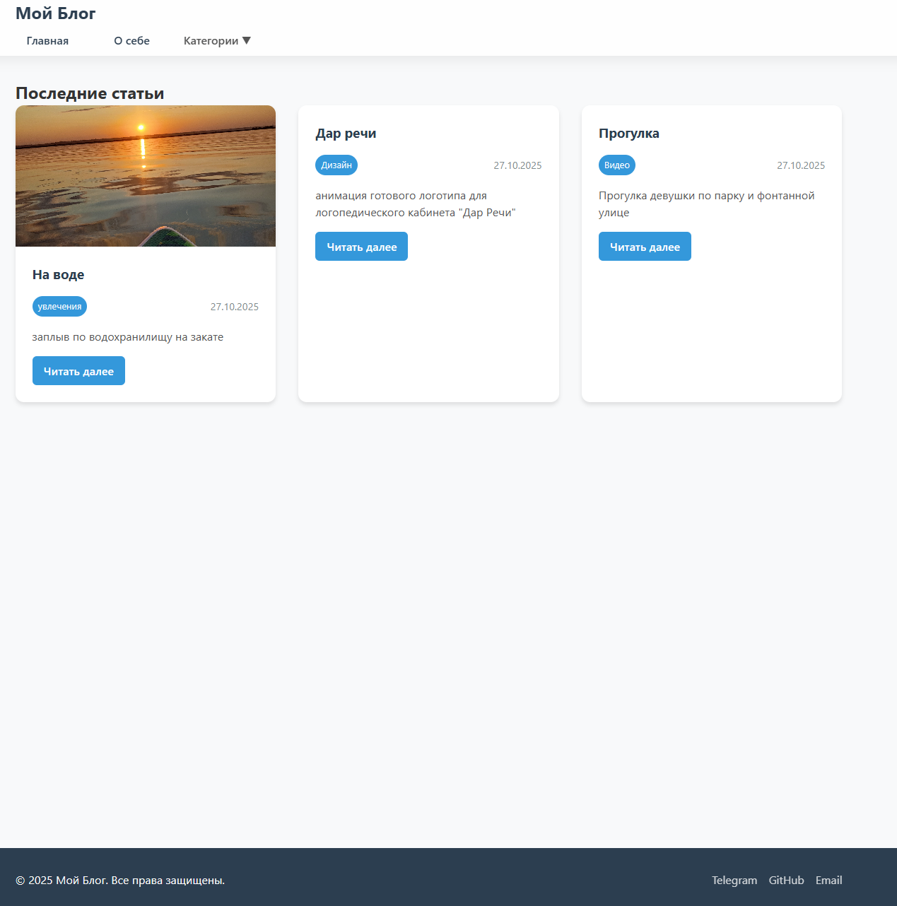
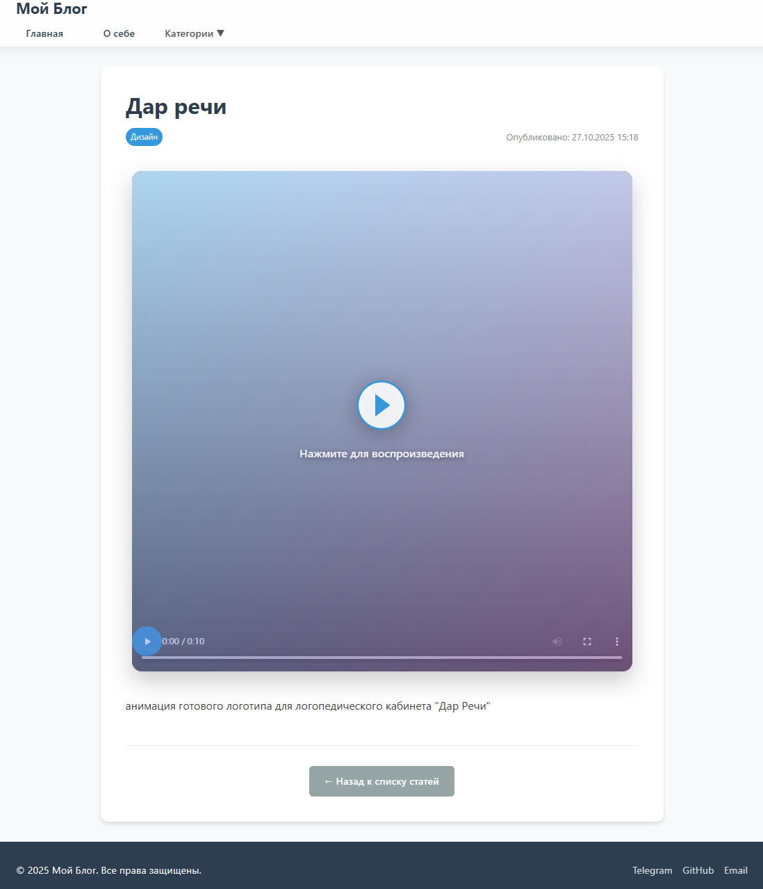
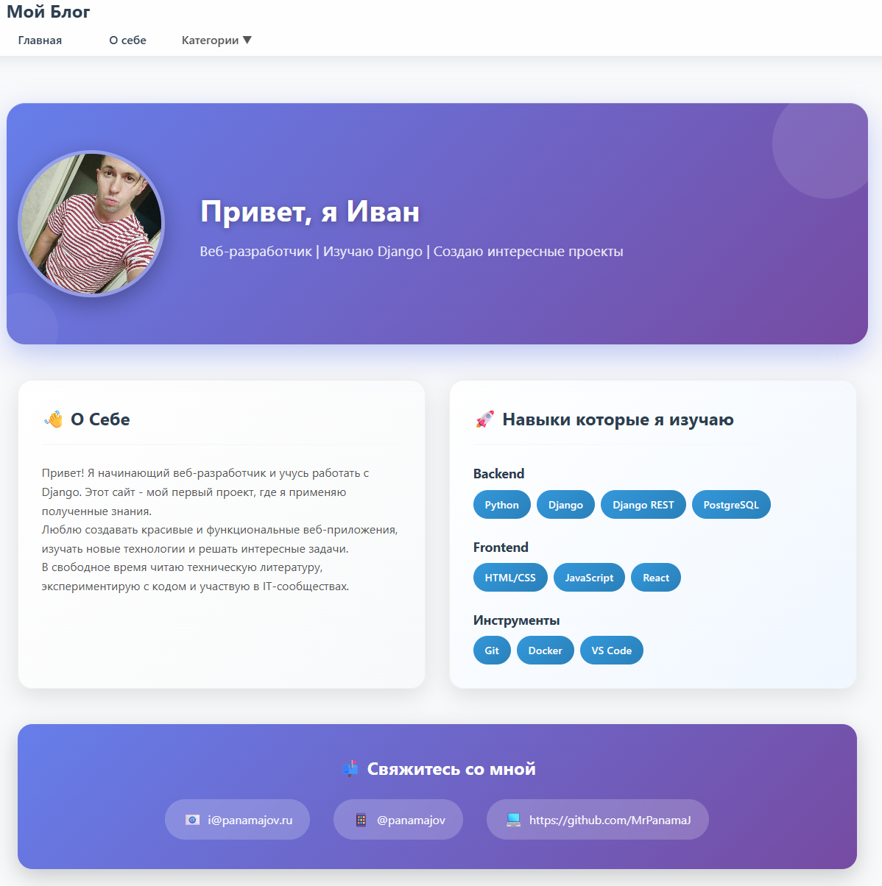
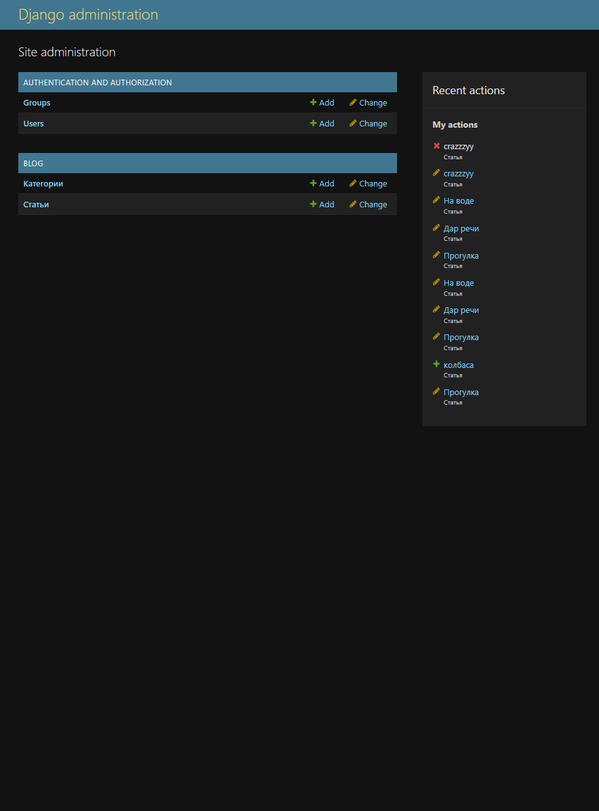

# 🚀 My Django Blog

Полнофункциональный блог на Django с современным дизайном, системой категорий и поддержкой медиафайлов.


## 🌐 Live Demo
**Сайт доступен по адресу:** https://MrPanama.pythonanywhere.com

## 📖 О проекте

Это полноценный веб-блог, разработанный с нуля на Django. Проект включает в себя все необходимые функции современного блога:

### ✨ Основные возможности
- **📝 Система статей** с богатым текстовым редактором
- **📂 Категории и теги** для организации контента
- **🖼️ Поддержка медиафайлов** (изображения, видео)
- **🎨 Адаптивный дизайн** с современным UI/UX
- **👤 Админ-панель** для управления контентом
- **📱 Mobile-first** подход
- **⚡ Быстрая загрузка** и оптимизация

### 🛠 Технологический стек

**Backend:**
- Python 3.13
- Django 5.1.3
- SQLite (разработка) / PostgreSQL (продакшен)
- Pillow для работы с изображениями

**Frontend:**
- HTML5, CSS3, JavaScript
- Custom CSS с Grid/Flexbox
- Адаптивная верстка
- Стеклянный морфизм (Glassmorphism)

**Инфраструктура:**
- Git для контроля версий
- PythonAnywhere для хостинга
- GitHub для хранения кода

## 🎯 Ключевые особенности

### Дизайн и UX
- Стильная навигация с анимированными капсулами
- Закругленные карточки постов с тенями
- Стеклянный эффект хедера (Glassmorphism)
- Плавные анимации и переходы
- Полная адаптивность для мобильных устройств

### Функциональность
- **Система постов:** Заголовок, контент, изображения, видео
- **Категории:** Группировка постов по темам
- **Медиафайлы:** Поддержка изображений и видео с превью
- **Поиск и фильтрация:** По категориям и тегам
- **Админка:** Полный контроль над контентом

## 📸 Скриншоты

### Главная страница


### Страница поста


### Страница "О себе"


### Админ-панель


## 🚀 Установка и запуск

### Предварительные требования
- Python 3.8+
- Django 5.x
- Pillow

### Локальная установка

1. **Клонируйте репозиторий**
```bash
git clone https://github.com/MrPanamaJ/my-django-blog.git
cd my-django-blog
